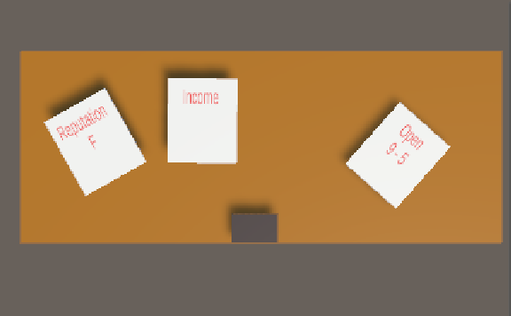
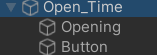
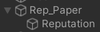

# Animart

> 1,553 Word excluding references and code.

## Introduction
Animart is a single player mobile game. As a Shop Owner, players scan store items to make money whilst haggling with customers and then using this money to improve states (Charisma, Shop Time and etc). Whilst upgrading after 5 in game days you would've needed to make a certain sum of money to pay rent of the shop, if you were unable to pay the rent you would lose the game and have to start from day 1 again.

It took a team of four game developers, over six week period to get this game to a working prototype unfortunately not to the stage we would of liked however, as this game did not feature many assets or game mechanics we were hoping to have by then deadline for this project.

## Target Audience 
Our game was targeted towards children 12+ as this game with have some mechanics which would be harder for younger children with having to keep money back to pay rent and seeing which stats you as the player would need to upgrade and a what times to allow you to optimise your game play. 

## Inspiration 
Our game was inspired by the Roguelike genre Balatro, which is a card game in which you have to complete certain amount of points using poker hands to collect them and upgrade throughout the game to be able to create larger point and win.

## Unity Programming
I constructed my areas of the project using Unity. This game was made using the 3D instance of Unity which allowed us to make our game in 2D or 3D as well. Our game would use a 2.5D aspect allowing you to see the table and the NPCs at the same time but also allowing us to hide certain assets behind the table making the instantiating of assets to seem more smooth.

Most of the scripts would run behind the scenes collecting data which will be displayed at the end of the day. These pieces of data would then be displayed on the desk by pieces of paper each showing a different piece of data.

### Score Paper
When starting our game I created a large cube to hold which would act as the desk to hold the pages of scores.



After this I created three planes which would act as sheets of paper to hold the scores from the day people in the gameplay this would then have a RigidBody attached to allow the paper to have gravity and be lifted around the scene. This was then changed due to how the scene would be set. If the page had gravity it wouldn't be on the desk and leave the screen as the desk is a 2D horizontal plane.

The page would have a child connected to it being TMP Text. This would be where I am able to add the text for the score after the gameplay is completed. These would automatically update by reading the variable of Jack and Solar scripts allowing me to take their values and display them in a way easy enough for younger players to see. For example Reputation is a stat the player can improve through minigames on the characters phone which will increase how many customers will come into the store for you to serve as well as increase the value of items in store and whilst haggling. This was shown with a grade from F rank to S rank like in many games.





### Text Mesh Pro
To create each script I had to use different functions to give the outcome I needed, however due to not being very confident my ways about creating these scripts wasn't very efficient. leading to longer scripts then needed. The first script I created was the reputation script which would give you a value from F to A on how high your reputation is and if it increases above 100 it will become S rank and stay there. Right now that is all this script will do as unfortunately we did not get far enough into development to implement my areas of code into the game itself. For the prototyping of the script I used a variable called Rep as a place holder for when they would be added to main scene allowing me to access the characters stats and place them onto the sheet.

https://github.com/user-attachments/assets/3f980f8b-2912-4b6d-b723-d7a9c9e8bf10

#### Reputation Paper
The serialize field is where I connect The text asset to this script allowing this script to then show onto the paper. As you can see below to make this script work it works on if statements and else if statements, this allowed me to make sure each value was consistent through out the game.

```csharp
public float Rep = 1;
[SerializeField] TMP_Text Reputation;
void Update()
{
  if (1 >= Rep)
{
  Reputation.text = "Reputation F ";
}
else if (1 <= Rep && Rep <= 15)
{
  Reputation.text = " Reputation F ";
}
else if (16 <= Rep && Rep <= 30)
{
  Reputation.text = " Reputation E ";
}
else if (31 <= Rep && Rep <= 45)
{
  Reputation.text = " Reputation D ";
}
else if (46 <= Rep && Rep <= 60)
{
  Reputation.text = " Reputation C ";
}
else if (61 <= Rep && Rep <= 75)
{
  Reputation.text = " Reputation B ";
}
else if (76 <= Rep && Rep <= 90)
{
  Reputation.text = " Reputation A ";
}
else
{
  Reputation.text = "Reputation S ";
}
```

There are more efficient ways to create this code making it more readable as well. This version of the code would avoid the repeated range checks that would run every if statement. This version of code is also a lot easier to change and scale if we ever needed to up scale the game further.

```csharp
void Update()
{
    Reputation.text = $"Reputation {GetReputationGrade(Rep)}";
}

private string GetReputationGrade(float rep)
{
    if (rep <= 15) return "F";
    if (rep <= 30) return "E";
    if (rep <= 45) return "D";
    if (rep <= 60) return "C";
    if (rep <= 75) return "B";
    if (rep <= 90) return "A";
    return "S";
}

```

#### Money Paper
To create the money script I followed the same setup as the reputation script with a variable called money and the serial field to connect the TMP text to the script. For this script to work in the game it would take the Shops final income from the end of the day, so that the player can see how much money they have to spend at the end of the day in the game. This allows the player to then purchase the upgrades that are available in the store for them whilst also allowing them to keep an eye on having enough money to succeed at the end of the in game week. To show the value on the paper I used a string Interpolation which allows the compiler to know there's an expression which needs evaluating. I used this method instead of "Income.text = money.ToString("Income: " + money)" as this would lead to when I would have a value of 110 for example it would lead to 110110 as an output.

```csharp
public float money = 0;
[SerializeField] TMP_Text Income;

void Update()
{
  Income.text = $"Income: {money}";
}
```

#### Opening Hour Paper
The final piece of paper I had made was for opening and closing time, this piece of paper would be an upgrade that could be brought allowing player to have more time to serve more customers. This would be directly linked to the timer and is connected by being in the script. By doing this it does make the script more complicated and could of been split into two scripts which would call on each other allowing us to add an end to this script and it stop the customers from spawning. To create this script I had to do the same TMP text on to the paper and then create a time which I did using a TMP canvas as well this would show the timer always at the centre top, this would stay here even if the player could move around the scene working as a Hud (Heads Up Display). To display text on to these areas I used a serialize field to attach both areas of text as well as a variable call remaining time which was set to 300, this would be seconds for right now.

```csharp
[SerializeField] TMP_Text openTime;
[SerializeField] TextMeshProUGUI timerText;
float remainingTime = 300;
```

After setting these references i then started to work in the update field. adding the variable Timer which will run every frame this will then constantly update the Timer function.

```csharp
// Update is called once per frame
void Update()
{
  Timer();
}
```

finally I made the timer which would mostly run on an if statement, which will constantly check if the time if bigger than 0 and if it is it will proceed to take away time in seconds. This code works really well as Time.deltatime counts the amount of time between each frame allowing the counter to go down in real time. The final part of the if statement will make the time remaining 0 if there is no more time left and announce in the debug log "Game Over". Unfortunately I had not implemented this full due to the fact there were a large amount of changes from other developers and a lack of communication between us all.


```csharp
void Timer()
{
  if (remainingTime > 0)
  {
    remainingTime -= Time.deltaTime;
  }
  else if (remainingTime < 0)
  {
    remainingTime = 0;
    Debug.Log ("Game Over");
  }
```

The last part of the timer code was the set up for the timer in the centre of the screen. This code converted the remaining time into minutes and seconds and then proceeds to show them in the form set up by the timerText.text which will be shown at the top of the screen.

```csharp        
  int Minutes = Mathf.FloorToInt(remainingTime / 60);
  int Seconds = Mathf.FloorToInt(remainingTime % 60);
  timerText.text = string.Format("{0:00}:{1:00}", Minutes, Seconds);
}
```

https://github.com/user-attachments/assets/23dbc872-1d18-405e-a1e8-d87d8a91181a

### Conclusion
In conclusion from the work done in this project none of my work was able to be implemented due to miscommunication between peers, large changes constantly happening as well as our group not being determined to create a game we enjoyed. I believe the work I have done on this project does show this as after looking back on this project i believe that it could of been ran, developed and coded different after completing working on my latest project "Time Heist". The areas that I believe needed to work on more whilst doing this project would be using the Unity manual more closely instead of using simple ways of writing this code. I also believe that my group could of done with more structure as a group and a clear set goal from the start that doesn't effect our certain areas of the group close to the deadline.

# Reference
-[Unity manual](https://docs.unity3d.com/2022.3/Documentation/Manual/UnityManual.html) (2022)
-[Make a TIMER & COUNTDOWN in 5 Mins | Unity Tutorial for Beginners by Rehope Games](https://www.youtube.com/watch?v=POq1i8FyRyQ&t=185s)-Youtube (2024)


