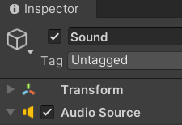

# Time  Heist

> 3,746 Word excluding references and code

## Introduction
Time Heist is a single player VR game. As a time traveller, players use powers to go back in time to important historical sites. They are tasked with collecting artefacts for their museum however, on entry to the pyramid, it caves in on the player, giving them just 3 minutes to collect as many valuable artefacts as they can before being stuck in the pyramid forever.

It took a team of six game developers, over a six week period, to get the game to a working prototype. We would meet each Tuesday to discuss the progress each of us had made, and to decide what needed to be created over the next week. This enabled us to bounce ideas off each other, improve scripts, understand code we didn't know, and gain a new perspective on what we were working on. As a result, our teamworking skills were elevated to the next level. The team consisted of Kian Wootton, Dom Duggan, Ryan McFly, Chris Sirell, Louis Tucker and Caitlin Hannan. 

## Target Audience
Our game is child friendly (suitable from the ages of 7+), and is accessible to most people. Our game doesn't use explicit violence, blood and gore or sexual content. The aim was to make a game with the intent of showing it at the Code & Canvas event at Winchester University, making it important that the game be available for everyone. We also paid close attention to colours used in our game, due to one of our developers being colour blind. As a result, the game is made with his specific colour blindness in mind.

## Inspiration
Our game was inspired by a number of recent popular PC games, more specifically by a collection of games that would be called a maze. Our game was mainly inspired by R.E.P.O, Lethal Company and Content Warning. These three games use the feature of maze like maps that require you to remember where you are going in them, whilst also collecting valuable objects to take back to a ship or designated area on the map. The aim within these games is also to avoid creatures/ monsters along the way. In our game however, we did not include any creatures but this is something we wish to include in a later iteration of our game. In contrast to the games we analysed however, one thing we did do differently was to make ours in VR, thereby giving the game genre a different perspective. 

## Unity Programming
We created our game with Unity using the XR plugins. This meant that we could create the game in VR with some scripts already in the package, and as such,  we did not need to learn how to make a VR interface from scratch. Through unity we were also able to build our game straight onto the VR headsets, allowing us to test our game at anytime as needed. This allowed us to progress faster, and to quickly spot issues, both with our own script as well as each others scripts. 

For my part of this project, I chose to work on the games Items. This meant I was working with the artefacts you would find around the Pyramid that were available to collect, as well as the other interactable objects such as the torches and an object scanner. I decided that the main characteristic of the objects was that they needed to be interactable; each object had to have a value; it had to be damageable and it also had to have visual and audio cue for damage.

### Object Rigging
When creating these objects, I started by using a cube as a place holder for my prefabs which were being made by the design side of our team. The components for the cube were:
- RigidBody
- Box Collider
- XR Grab Interactable Script


#### RigidBody
The RigidBody allowed me to collect the X and Y co-ordinates of the object at every frame, thereby allowing me to calculate the velocity of the object more easily which, is very important for the Fall Damage Handler Script. The RigidBody also allowed me to add gravity to the object, this is because the RigidBody is a physics based component which allows developers to make the games world more realistic.

#### Box Collider
The Box Collider allowed me to make the object interactable, allowing it to be picked up and hit against the floor and walls without leaving the map. It also helps registration of the collision in relation to the object Fall Damage Script.

#### XR Grab Interactable Script 
This Component involved a Script which was included in the plugin for the VR side of the game. The script allowed the left and right VR controllers to pick up object in the game and interact with them. The Script also allows the player to choose how they want the object to interact with the world in terms of Movement types (such as velocity tracking, Kinematic and Instantaneous). We opted for velocity tracking for most objects in the game as this allows the hands to move with the object, sets the velocity of each object, and makes sure that the object cant go through other objects using the RigidBody.

### Scriptable Object
To create our artefacts, we decided much of the information for the artefacts would be the same, with the aim of making the game more proficient. I created Scriptable objects which allowed us to to create objects with the same type of information whilst still allowing the values of the information to be changed.This prevented me having to create lots of different scripts to do the same thing. For the first iteration of the code looked like:

```csharp
{
   public string objectName; // Objects Name 
   public float mass; // weight of the object
   public float health; // value of the health
   public float value; // how much object is worth
   public Gameobject objectprefab; // objects prefab
}
```

I decided to randomise the values within the scriptable object allowing it to be confined into one object, however, I later changed this so that every object that was using this script would not be able to have the exact same values. 

```csharp
   // Randomises the values of health, mass and value
   public void Randomise()
   {
      health = Random.Range (20, 100);
      mass = Random.Range (20, 100);
      value = Random.Range (40, 1000);
   }
}
```

For ease, I decided to add this line of code to scriptable objects, that creates a button inside the 'create' tab within unity. This allowed us to make as many scriptable objects as we wanted, and with greater efficiency.

```csharp
// Allows you to create a Scriptable object from the create menu in unity
[CreateAssetMenu(fileName = "ScriptableItems", menuName = "ScriptableObject/ScriptableItems")]
```

After creating this script, I realised that it was not necessary to include a Value and a Health stat as they would do the same thing within the script. As such,I decided to remove both the health values and the Game Object prefab as they wouldn't be attached to the object, and to Instantiate in the the scripts.

```csharp
{
   public string objectName; // Objects Name 
   public float mass; // weight of the object
   public float value; // how much object is worth

   // Randomises the values of health, mass and value
   public void Randomise()
   {
      mass = Random.Range (20, 100);
      value = Random.Range (40, 1000);
   }
}

```
After these changes had been made, I began working on the Object information script. At this point, it would only pull the values that it needed from the scriptable object (Value). Whilst making the damage script and the audio mixer I decided to move some of the other key information each object would need onto the objects (for example, audio and damage multipliers allowing for all values which will either stay the same across all object or will change slightly to be in the the scriptable object). This meant only values were stored. I also decided to remove any functions including the randomise to the Object Information script as this would allow all objects to have a different value even if they had the same scriptable object. This scriptable object also no longer randomised the values of certain pieces of information (like value), as we did not want each object to have the same price.  

```csharp
{
   public string objectName; // Objects Name 
   public float mass; // weight of the object
   public AudioClip damageAudio;
   public float safeFallVelocity; // Hieght for the item to take damage
   public float damageMultiplier; // Set the multiplier for damage  
   public float minValue; // min value of object
   public float maxValue; // max value of object
}
```

### Fall Damage
I then decided to work on the damage the objects would take. For the object to do this we needed to track their velocity and decide what should and shouldn't be able to damage the item. We decided that any object in the rooms should be able to damage the artefacts, except other artefacts. To do this, we gave every item the wall or floor layer allowing us to treat them all the same when calling for layer masks. We then decided to use an interface to make them damageable in the game, this meant that the script had to run a function otherwise the code wouldn't work. This allowed it to be a security net for us.

For our code to work, our Interface (IDamageable) had to run this function for the damageable item to work. This piece of code had to be on our main script (the Object information script) to enable the items to be damaged. 

```csharp
public interface IDamageable // damage Interface
{
    void Damage(float impactVelocity); // calls damage 
}
```

After creating this script we had to make sure whatever script would do damage to the object had IDamageable on it, allowing us to run this function.

```csharp
public class ObjectInformation : MonoBehaviour, IDamageable
{
    [SerializeField] private ScriptableObjectInformation ItemInformation; // ScriptableObject that stores object data (e.g., name, min/max value, etc.)

```

As you can see in this code it has the IDamageable on the end of the MonoBehaviour, allowing it to run the damage function in this script. The SerializedField was also deemed important, as this is what allowed us to connect this script to our scriptable objects and to run the damage to them. Without this piece of code, It would have caused problems like all objects having the exact same sound, value and multipliers. This would have made the script less efficient and harder to read. The aim was to break everything up to make it easier whilst not putting everything into different scripts as this would make things more confusing.

```csharp
// Method required by the IDamageable interface to handle fall damage
    public void Damage(float impactVelocity)
    {
        // Only apply damage if fall speed exceeds safe threshold
        if (impactVelocity > ItemInformation.safeFallVelocity)
        {
            // Calculate damage using the velocity difference and multiplier
            float damage = (impactVelocity - ItemInformation.safeFallVelocity) * ItemInformation.damageMultiplier;

            // Subtract damage from the object's current value
            value -= damage;

            // Log the damage taken and the new value
            Debug.Log($"Object took {damage} fall damage! Health is now {value}");

            // Destroy the object if its value drops below 1
            if (value < 1)
            {
                Destroy(gameObject);
                Debug.Log("Break Me!!");
            }
        }
        else
        {
            // Log that the object landed safely with no damage
            Debug.Log("Object landed safely. No damage taken.");
        }
    }

```

This script was required by the IDamageable interface to allow us to take the damage off the artefact. The code starts within an 'if' statement which only takes the damage off the artefact if the objects velocity on impact is higher than its safe velocity. If the velocity is high enough, then the function will start, otherwise the statement will not do anything except say it was safe in the debug log.

```csharp
 // Only apply damage if fall speed exceeds safe threshold
   if (impactVelocity > ItemInformation.safeFallVelocity)
   {
   }
   else
   {
      // Log that the object landed safely with no damage
      Debug.Log("Object landed safely. No damage taken.");
   }      
```


If the function does get called, it will calculate the damage for the artefact by taking the impact velocity away from the safe fall velocity which is found within the scriptable object. This will then be multiplied by the damage multiplier which can also be seen on the scriptable object. This will then be taken away from the value of the artefact. 

```csharp
// Calculate damage using the velocity difference and multiplier
   float damage = (impactVelocity - ItemInformation.safeFallVelocity) * ItemInformation.damageMultiplier;

   // Subtract damage from the object's current value
   value -= damage;
```

Finally, for the damage calculation, I added an 'if' statement which checks if the artefacts value is below one and will destroy the object in the scene. This will then call in the debug log showing how much damage the artefact will take. It will also tell me if them object broke in the if statement. 

```csharp
// Log the damage taken and the new value
   Debug.Log($"Object took {damage} fall damage! Health is now {value}");

   // Destroy the object if its value drops below 1
   if (value < 1)
   {
   Destroy(gameObject);
   Debug.Log("Break Me!!");
   }
```


After creating the code which calculates the damage, I created a script to figure out if the artefact was in the air when it collided into a wall or floor and what the impact velocity is.

First I had to reference the RigidBody as this is what I will be using to collect the velocity of the Artefact. I also had to set both the floor and walls to false so that when they start off in the scene they will become 'True' once on the floor or objects. I also needed to make variable I could call, which is the Finalvelocity which starts at zero so that when its off the ground it can start to calculate the velocity. Finally I had to reference the Interface so that it can be applied to the object which will lead into the previous damage script for the object,  

```csharp
private Rigidbody rb; // Rigidbody reference to get velocity
private bool isGrounded = false; // Tracks whether the object is touching the ground
private bool onWall = false; // tracks whether the object is touching the wall 
private float Finalvelocity = 0f;
private IDamageable damageable; // Interface reference to apply damage
```

For the next part, two components from the scriptable object and the Object Information script were needed. I had to get the RigidBody component from the artefact and call it rb in the scripts, then I had to call the interface IDamageable from the interface and call it damageable. Finally, I have to ensure in every update, that if the artefact was not on the ground it would start to take the X and Y co-ordinates and track the velocity of the object until it collides with an object. 

```csharp
private void Start()
{
 rb = GetComponent<Rigidbody>(); // Get Rigidbody component
 damageable = GetComponent<IDamageable>(); // Get the damageable component (must implement IDamageable) 
}

void Update()
{
 // While the object is in the air, track the downward velocity
 if (!isGrounded)
 {
  Finalvelocity = rb.velocity.y + rb.velocity.x;
 }
}
```

To figure out if the artefact has collided with any surfaces we used tags on the surfaces. For example, the walls have the Wall tag which this code looks for on the objects when they collide with any pieces of the scene. If the area of the scene has the correct tag, this script will make the impactVelocity the same as the Finalvelocity as an absolute value. 

```csharp
void OnCollisionEnter(Collision collision)
{   
   // Check if the object lands on the ground and wasn't already grounded
   if (!isGrounded && collision.gameObject.CompareTag("Ground"))
   {
      // Calculate impact speed from the last recorded fall speed
      float impactVelocity = Mathf.Abs(Finalvelocity);
```

The script will then check to see if the object will support the IDamageable interface by looking through the scripts that are on it. If the object does have the IDamgeable, it will apply the damage across to the damage script on the ItemInformation script, finally making the grounded true. The final 'if' statement repeats it all again for the walls, differentiating between being flung at the walls rather than rolling into the walls. This allowed us to use this code to do other damage later, as we may wish to consider possible addons to the game (for example calculating player fall damage). 

```csharp
      // Apply damage based on impact velocity if the object supports the IDamageable interface
      damageable?.Damage(impactVelocity);

      // Mark object as grounded again
      isGrounded = true;
   }
        
   if (!onWall && !isGrounded && collision.gameObject.CompareTag("Wall"))
   {
      float impactVelocity = Mathf.Abs(Finalvelocity);
      damageable?.Damage(impactVelocity);
      onWall = true;
   }
}
```

The final piece of this script checks the object to ensure that it has left the ground and wall when the colliders are no longer are next to each other. By making the ground and wall false it allows for an update of velocity again. 

```csharp
void OnCollisionExit(Collision collision)
{
   // When the object leaves the ground, it's considered falling again
   if (collision.gameObject.CompareTag("Ground"))
   {
      isGrounded = false;
   }

   if(collision.gameObject.CompareTag("Wall"))
   {
      onWall = false;
   }
} 
```
### Damage Indicator
Most games have a type of indicator showing when damage is done, for example a flash of colour or a health bar which appears when you start to fight. For our game, I decided to add three types of damage indicators: sound effects; a visual red flash and the amount of damage appearing above the artefact. This allowed for a multitude of ways for the player to know that the object has taken damage without using the scanner object. These additions also help support players who are visually impaired. For example, if the flash of red on an object is not seen, they can still see the bar above the artefact and hear the sound. 

#### Flash Damage Indicator
To create the flash effect, I used a coroutine which would be activated when the damage function ran. This allowed for the routine to run at the same time as the damage dealt with the object. To do this, I had to reference the meshRenderer, the original colour of the material and create a variable called flash time. 

```csharp
MeshRenderer meshRenderer; // Reference to the object's MeshRenderer to change material color when damaged
Color origColor; // Stores the original material color for damage flash effect
float flashTime = 0.15f; // Duration of the red flash effect when damaged
```

Development of a coroutine using IEnumerator allowed the artefact to flash a colour. I could then tell the script to do something, then wait for a certain amount of time, then do something else (change the materials colour to red, wait a certain amount of time (0.15f), then revert the material to its original colour).

```csharp
// Change the object's material color to red
meshRenderer.material.color = Color.red;

// Wait for a short duration specified by flashTime before continuing
yield return new WaitForSeconds(flashTime);

// Revert the object's material color back to its original color
meshRenderer.material.color = origColor;
```

#### Visual Damage Number 
To Create the damage number appearing over the artefacts in the game, I considered two ways, either to create an animation which would play above the artefacts or to use canvases and use Text Mesh Pro (TMP) to show the damage taken. I originally wanted to make an animation (see below), however, I was not sure how to implement the animation into the game, so I proceeded with the canvases instead (I had prior experience with TMP on my game project Night Terrors), the only difference being that I only needed to show it for a short amount of time and then make it disappear. I also needed to follow the camera so that any damage to an object could be seen from any angle.

To start my canvas version, I had to start in the scene and create a prefab called "DamageUI" which would use the canvas and TMP text to show the damage above the artefact. Firstly, I used the create tab to make a canvas, then I added a text component as a child to the canvas and named it DamageUI, which I then moved from my scene hierarchy to the asset tab turning it into a prefab. I then added a UIspawnpoint to the artefact prefabs allowing for an exact spawn area.

The Next step was adding to the Item information script which will activate at the same time as the coroutine and the calculation of the damage. To start this I had to reference the DamageUI prefab in the script.

```csharp
public GameObject damageUIprefab; // Prefab used to visually display damage taken
```

The next step was get the canvas to spawn above the artefact. To do this we took the position of the spawnUI on the prefab. Without this, it would spawn above the artefact. Afterwards, it would then create the damage UI at the position calculated and display the damage value with a minus next to it (e.g. "-25"). 

```csharp
// Spawns floating damage text UI above the object
void ShowDamageUI(float damage)
{
   if (damageUIprefab != null)
   {
      // Determine spawn position for UI
      Vector3 spawnPos = uiSpawnPoint ? uiSpawnPoint.position : transform.position + Vector3.up;

      // Instantiate the UI and set its text to the damage value
      GameObject ui = Instantiate(damageUIprefab, spawnPos, Quaternion.identity);
      ui.GetComponentInChildren<TextMeshProUGUI>().text = "-" + damage.ToString("0");
   }
}
```

To ensure that the damage did not just sit above the artefact, I decided to make it float above the artefact and then disappear after a certain amount of time had passed. To do this, I had to make two variables: one being a float speed and the other the duration of the damage value. The two functions would then be called in every frame in update. This isn't the most efficient way of doing this, but unfortunately I didn't know a better way to do it at this point. However, if I was to remake this script, I could use a function in the damage script for a floating script.

```csharp
public float floatSpeed = 0.25f;
public float duration = 1f;

// Update is called once per frame
void Update()
{
   Float();
   Follow();
}
```

The next challenge was to create functions that appear in the Update. I began with the Float function, which took the position of the Text, then started going up at the speed set by the float speed variable and the delta time. This allowed it to go in speed with the device the player is on. When the Delta time becomes zero it will destroy the text box on the artefact. 

```csharp
void Float()
{
   transform.position += Vector3.up * floatSpeed * Time.deltaTime;
   duration -= Time.deltaTime;

   if (duration <= 0)
   {
      Destroy(gameObject);
   }   
}
```

I then started on my follow function which allowed for the camera to always see the damage from left to right, and not inverse on its self. This required the transform that is forward to follow the camera to look at the damage. 

```csharp
void Follow()
{
   if (Camera.main != null)
   {
      transform.LookAt(Camera.main.transform);
      transform.rotation = Quaternion.LookRotation(Camera.main.transform.forward);
   }
}
```

https://github.com/user-attachments/assets/b2a6a266-eecd-4ed9-89f5-89f63f096add


## Audio
The final area I worked on was audio for our game (note, I am not the creator of any audio tracks used in our game, some were from a royalty free website and the others were from [Kenney](https://www.kenney.nl)). To begin making our audio for the game we decided that we needed background music for our menus, ambience, torch effect as well as damage audio for our scenes. I was able to find two different music tracks from Kenney which we put into certain scenes, and made the audio 2D which allowed the audio to play across the whole scene. I did the same for the ambience sound which was a bass rumble on loop. Unfortunately as this part of the project was done just a day before the deadline, I had only three audio clips for damage and my looping torch effect. This meant that the diversity for my audio tracks was low and most assets had the same effects on them. 

To give the items, and the world within which they set, it's music, I first had to add a component called audio source a child prefab of the artefacts and the torch. I then chose which audio would be connected to which artefact and added them to the Scriptable object. This allowed me to better organise the artefacts and allow for the damage noise to run simultaneously. One notable difference between the audio of the artefacts and the background noise however, was that the audio was in 3D form. This meant that when inside the VR headset, the audio for damage or the torch would only play in the ear closest to the noise (unless it was right infront of you or very close to your ears). This allowed us to add more realism into our game.




The final part for the audio was to make sure every noise was balanced between the audio tracks. To do this, I grouped the audio tracks with background audio, with ambience being in the master group and the torch and damage noise being in a SFX group. This allowed me to set the audio levels in the audio mixer. I made sure that when the SFX sounds played they would be louder than the master group, allowing for the player to be a little shocked when the objects broke. I also lined up the the sound prefab with their artefacts, thereby allowing the noise to radiate from the artefact not too far away, so if you damage an object you wont hear it from the other side of the Pyramid.


To create the damage audio to go off at the same time the artefact is damaged, I had to add a damage sound function to my Object Information script with. This function checks whether there isn't an audio source on the object, and if it doesn't exist, it will find the component on the child prefab sound. Once this has been found and the damage audio has been found, it will play a one shot of the damage audio. 

```csharp
// Plays a sound effect when the object takes damage
void DamageSound()
{
   // Ensure we have an AudioSource to play from
   if (audioSource == null)
   {
      audioSource = GetComponent<AudioSource>();
   }

   // Play the damage sound if both audio source and clip are set
   if (audioSource != null && ItemInformation.damageAudio != null)
   {
      audioSource.PlayOneShot(ItemInformation.damageAudio);
   }
}
```

## Feedback
As a result of our exhibition of the game at Winchester Code & Canvas, we have received a large amount of feedback. We now plan to use the comments to create a demo we are happy with.

In particular, I received helpful feedback about collision with the controllers. I could implement a code which takes the velocity of the hand when they collide with an artefact and take away the safe velocity, this would work similarly to the fall damage script as it is now. 

Another feature we would like to look into is the use of 'force' grabbing which is when an object is close to your hand you can press the grab button and it will levitate towards your hand, like is seen in many VR games (Blade and sorcery as well as The Walking Dead). 

## Conclusion 
This was a demanding project lasting six weeks. We had set ourselves the difficult goal of creating a game using a device we had not used necessitating us to look into some areas of game development we hadn't considered before; for example the motion sickness experienced by players is something we would wish to address. We would also like to understand more about how VR adds many different mechanics that can be added to a game itself.

I do believe that this project was a great success, particularly as a working prototype, and as a team, we are keen to keep making improvements over time. I am also pleased to report that this project has also taught me information about audio mixers, a slight amount about animation and new functions in unity (coroutine, interfaces and colliders).

I also acknowledge that a lot of this work has been done with the help of my peers in my group as well as [Unity manual](https://docs.unity3d.com/2022.3/Documentation/Manual/UnityManual.html) and assets brought by Ryan Mcfly on the unity asset store.

https://github.com/user-attachments/assets/e43d01cb-9dfc-4541-9c84-ec80267ef59e

# Reference

- [Unity manual](https://docs.unity3d.com/2022.3/Documentation/Manual/UnityManual.html) (2022)
- [Kenney](https://www.kenney.nl)
- [XR Simple Interactables in Unity XR Interaction Toolkit by Ryan Murray](https://www.youtube.com/watch?v=a1Hl1oqAVlE&t=480s)-Youtube (2023)
- [AUDIO MIXERS In Unity by Kap Koder](https://www.youtube.com/watch?v=pbuJUaO-wpY&t=2s)-Youtube (2022)
- [How to Make Damage Text and Number Popups in Unity | Tutorial by Wintermute Digital](https://www.youtube.com/watch?v=LjNsDVYXfrk)-Youtube (2021)
